# Ghost Infrastructure: Historical Industrial Geography and the Persistence of Path-Dependent Accessibility in Bochum, Germany

**Sakshi D. Maske**
Independent Geospatial Researcher

## Abstract

The theoretical concept of "path dependency" — that historical spatial decisions continue to shape present-day urban outcomes long after their original rationale has disappeared — is well established in economic geography, yet rarely tested with direct, quantitative spatial evidence, particularly at the scale of a single city's internal accessibility structure. This study tests whether Bochum's 19th and 20th-century coal-mining industrial geography — mine locations and worker-housing colonies (Zechensiedlungen) — continues to structurally predict present-day "15-minute city" walking accessibility, more than five decades after the region's last coal mine closed. Thirteen historical coal mines and four worker colonies were digitized from archival sources, and present-day accessibility was modeled using true network-distance isochrones across Bochum's complete 69,393-node pedestrian street network. Contrary to the hypothesis that historical industrial sites would predict present-day neglect, a Welch's t-test found the opposite: low-accessibility network nodes are significantly further from historical industrial sites than high-accessibility nodes (t=42.887, p<0.00001, Cohen's d=0.589, a medium-to-large effect). This reversed relationship was verified against its most obvious confound — proximity to the city center, a well-documented predictor of accessibility in the broader 15-minute-city literature — and found to hold independently (logistic regression coefficient=-0.0005, p<0.001, controlling for city-center distance; correlation between the two distance measures was low, r=0.063). A Local Moran's I spatial-clustering analysis independently corroborates this finding via a distinct statistical method: 97.1% of low-accessibility nodes fall within statistically significant spatial cold-spot clusters, confirming that low accessibility is not randomly distributed but forms genuine, spatially contiguous zones measurably farther from historical industrial infrastructure. The evidence supports a "path dependency of centrality" rather than a "path dependency of neglect": historical industrial infrastructure, built by necessity at the center of dense worker populations, appears to have left a durable legacy of street connectivity and service density that persists independently of the city's present-day center.

Two robustness extensions were subsequently added to test the generality of this finding. First, a walking-threshold sensitivity analysis found the reversed relationship holds — and its effect size grows — at both a stricter 10-minute (750m) and a more permissive 20-minute (1,500m) threshold (Cohen's d=0.413 and 0.661 respectively, both p<0.00001), not only at the 15-minute threshold originally tested. Second, the methodology was replicated in a second Ruhr Valley city, Essen, using four major historical coal mines and four worker colonies and Essen's own 72,027-node pedestrian network. The raw reversed relationship replicated in direction and significance (t=24.731, p<0.00001) with a smaller effect size (Cohen's d=0.338 versus Bochum's 0.589), and the Local Moran's I spatial-clustering result replicated almost exactly (95.5% of Essen's low-accessibility nodes fall within significant cold-spot clusters, versus 97.1% in Bochum). Critically, however, the confound-independence result did not replicate: in Essen, distance-to-historical-site is only moderately independent of distance-to-city-center (r=0.405, versus r=0.063 in Bochum), and a logistic regression controlling for both variables simultaneously finds the historical-site coefficient's sign reverses — indicating the historical-site effect in Essen is substantially entangled with, rather than independent of, city-center proximity. This is reported as a genuine finding about generalizability, not suppressed or explained away: the "path dependency of centrality" effect itself appears to replicate across cities, but the specific claim that this effect is independent of city-center proximity is, on current evidence, a Bochum-specific rather than universal result.

**Keywords**: path dependency, 15-minute city, urban accessibility, historical GIS, network analysis, post-industrial geography, multi-city replication, robustness analysis

---

## 1. Introduction

Bochum's urban form was never designed around human accessibility. It was built around coal mines and steel works, with railways, roads, and worker-housing colonies laid out to serve 19th-century industrial production. The last coal mine in Bochum closed in 1974. This study asks whether that historical industrial geography — more than half a century removed from its original economic function — continues to leave a measurable, statistically detectable imprint on which parts of the city today offer genuine walkable access to essential services.

## 2. Literature Review

### 2.1 Path Dependency: A Well-Established Theory, Rarely Tested Spatially

Path dependency — the principle that the past shapes the present through locked-in infrastructure and institutional decisions — is a long-established concept spanning economic geography, urban history, and evolutionary economics. Urban spatial structure has been characterized as heavily path-dependent, with a neighborhood's present-day form continuing to reflect the infrastructure, land-use patterns, and dominant transportation technology of the era in which it was built. Studies of port cities have similarly argued that the longevity of historical infrastructure investment makes spatial and institutional transitions difficult long after a port's original economic function has diminished. Work on post-industrial regional restructuring has extended this idea specifically to former coal and steel regions, arguing that industrial culture and cognitive "lock-in" — not merely physical infrastructure — shape whether a region renews or remains dependent on its industrial-era path, with the Ruhr region itself discussed as a case study of this dynamic (Görmar & Harfst, 2019). Despite this substantial theoretical foundation, direct, quantitative, GIS-based testing of path dependency at the scale of intra-city accessibility — rather than broad city growth patterns, institutional governance arrangements, or industrial-culture narratives — remains comparatively rare, representing the specific gap this study addresses.

### 2.2 The 15-Minute City and the City-Center Advantage

The 15-minute city framework, prioritizing proximity-based access to essential services via walking and cycling, has generated a substantial and rapidly growing empirical literature since 2021, with over 100 peer-reviewed publications identified in a recent systematic review spanning 2021 to early 2025. Network-based accessibility modeling — computing true walking-network distance to points of interest rather than simplified straight-line radii — has emerged as the dominant methodological approach in this literature, directly consistent with the network-distance methodology adopted in this study. A large-scale comparative study spanning 10,000 cities globally found a consistent and largely unsurprising pattern: city centers have measurably better service access than peripheral areas. This finding is directly relevant to the present study's methodology, since it establishes city-center proximity as a well-documented, independent predictor of accessibility in its own right — precisely the confound this study needed to rule out before treating any historical-industrial-site effect as genuine.

## 3. Data and Methodology

### 3.1 Study Area

Bochum, North Rhine-Westphalia, Germany — a defining Ruhr Valley coal and steel city from the mid-19th century through the 1950s, with its final coal mine closing in 1974.

  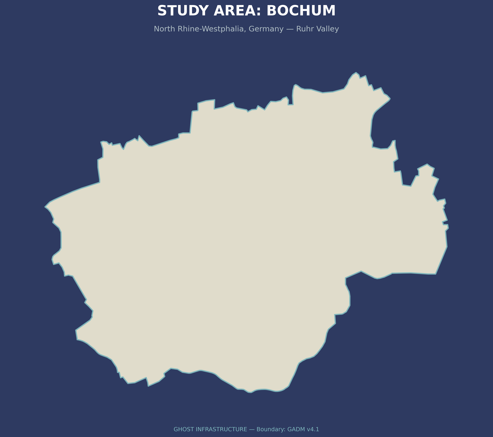

**Figure 1.** Study area showing the administrative boundary of Bochum, North Rhine-Westphalia, Germany. Bochum was selected as the study area because of its well-documented coal-mining history and its transformation into a post-industrial city, providing an ideal setting to examine whether nineteenth- and twentieth-century industrial geography continues to influence present-day 15-minute-city accessibility.

### 3.2 Historical Data

Thirteen coal mines and four worker-housing colonies (Zechensiedlungen) were compiled from Mindat.org and German heritage archival sources, kept as two independent, structurally distinct GIS layers given their categorically different nature (extraction site versus residential housing). A proposed steelworker colony was explicitly excluded during data review, since it was linked to steel rather than coal production. This dataset represents the major, well-documented industrial-era sites in Bochum rather than the region's complete historical mining register, which includes several hundred additional small-scale operations (Kleinzechen, Erbstollen) spanning multiple centuries that are not comparable in scale or documentation quality to the thirteen major Zechen analyzed here (see Section 6, Limitations). Steel-works and industrial-era rail and road infrastructure were part of the project's original conceptual scope but were not digitized in this phase, given archival availability and timeline constraints; digitizing them is identified as Future Work (Section 8).

  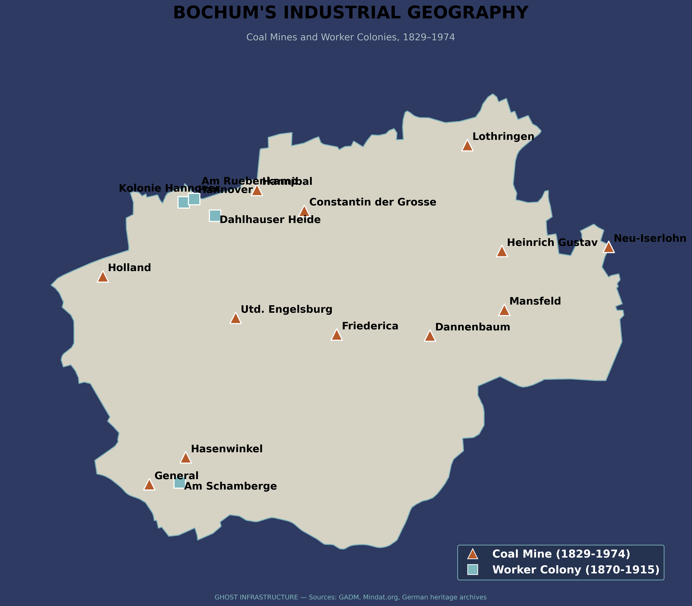

**Figure 2.** Historical coal-mining geography of Bochum derived from nineteenth-century industrial maps. Former mining sites are shown alongside the modern administrative boundary, providing the historical spatial framework used to evaluate whether legacy industrial infrastructure continues to influence present-day urban accessibility.

### 3.3 Present-Day Accessibility Model

Bochum's complete pedestrian street network (69,393 nodes, 169,668 edges) was acquired via OSMnx, alongside 786 essential-service points of interest across health, education, and daily-needs categories. A 15-minute walking threshold was operationalized as 1,125 meters of true network distance, computed via Dijkstra's shortest-path algorithm from every service location — consistent with the network-based approach dominant in the current 15-minute-city literature, and avoiding the straight-line-radius approach known to overstate real walkable accessibility.

### 3.4 Statistical Testing and Confound Verification

Distance from each network node to its nearest historical industrial site was computed and compared between low- and high-accessibility node groups via Welch's t-test, with effect size reported as Cohen's d (pooled-standard-deviation formula). Given the established literature finding that city-center proximity independently predicts accessibility, this was explicitly tested as a potential confound: correlation between distance-to-historical-site and distance-to-city-center, and a logistic regression predicting accessibility from both distance measures simultaneously, with coefficients additionally converted to odds ratios (percentage change in odds per 100m) for interpretability.

### 3.5 Spatial Clustering (Local Moran's I)

The t-test in Section 3.4 tests whether distance to historical sites *differs* between accessibility groups; it does not test whether low accessibility is spatially *clustered*, which is a distinct question and was the specific method named in this project's original Objectives. To test this directly, a K-nearest-neighbor (k=8) spatial weights matrix, row-standardized, was constructed over all 69,393 street-network nodes using their projected (EPSG:32632) coordinates. Local Moran's I (Anselin's LISA statistic) was then computed on the binary 15-minute-accessibility variable using 99 conditional permutations (seed=42), with statistical significance assessed at p<0.05 (`libpysal` and `esda` Python packages). Each node was classified into one of four quadrants — High-High (hot-spot), Low-Low (cold-spot), High-Low, or Low-High (spatial outliers) — based on its own value and its neighbors' average value.

### 3.6 Robustness Check: Walking-Threshold Sensitivity

The 15-minute threshold (1,125m network distance) used throughout Sections 3.3–3.5 is one specific operationalization of "walkable access." To test whether the reversed relationship is an artifact of this specific threshold choice, the full accessibility-classification and Welch's t-test pipeline (Section 3.4) was re-run at a stricter 10-minute threshold (750m) and a more permissive 20-minute threshold (1,500m), using the same 69,393-node network, service locations, and precomputed historical-site distances — no new data acquisition was required for this check.

### 3.7 Multi-City Replication: Essen

To test whether the "path dependency of centrality" finding is specific to Bochum or generalizes across the Ruhr Valley's shared 19th-century industrial urban form — a question this study's own Future Work section (Section 8) named as a priority — the identical methodology (Sections 3.2–3.5) was independently replicated in Essen, North Rhine-Westphalia, roughly 15km northeast of Bochum. Four major historical coal mines (Zeche Zollverein, Zeche Carl Funke, Zeche Vereinigte Helene & Amalie, Zeche Pörtingsiepen) and four worker colonies (Siedlung Carl Funke, Mathias-Stinnes-Siedlung, Kolonie Zollverein III, Kolonie Beisen) were digitized from KuLaDig (Kultur.Landschaft.Digital, the North Rhine-Westphalia state cultural-heritage GIS database) and German Wikipedia, each independently cross-checked against Essen's official administrative boundary (GADM v4.1) to confirm correct placement. This Essen dataset (8 sites) is explicitly a smaller subset than Bochum's (17 sites); Essen's own historical mining register is considerably larger — the city's official historical portal (historischesportal.essen.de) catalogs approximately 1,700 historical mining-related facilities citywide — and this study analyzes only the major, precisely-geocodable, well-documented sites reachable within this round's research scope, exactly mirroring the same major-sites-only scope decision already applied to Bochum (Section 3.2). Essen's complete pedestrian street network (72,027 nodes, 188,198 edges) and 366 point-based essential-service locations were acquired via OSMnx, and the identical 15-minute network-distance threshold, Welch's t-test, city-center confound check (using Essen Hauptbahnhof, 51.4517°N 7.0134°E, as the city-center reference point — the same station-based convention used for Bochum), and Local Moran's I spatial-clustering procedure (Section 3.5) were applied without modification.

  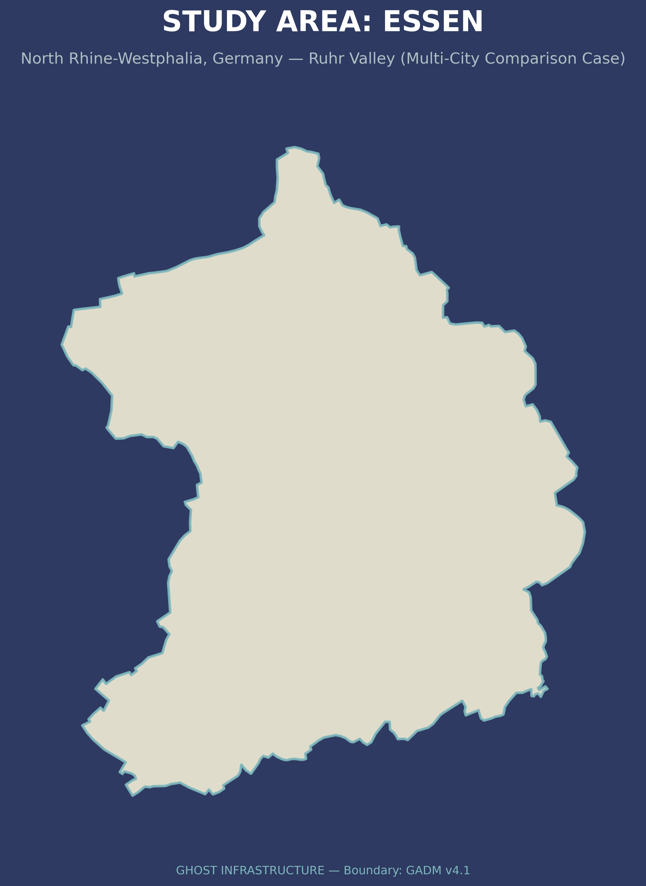

**Figure 3.** Study area showing the administrative boundary of Essen, North Rhine-Westphalia, Germany — the second Ruhr Valley city used to test whether the Bochum finding generalizes, directly comparable to Figure 1 (Bochum).

  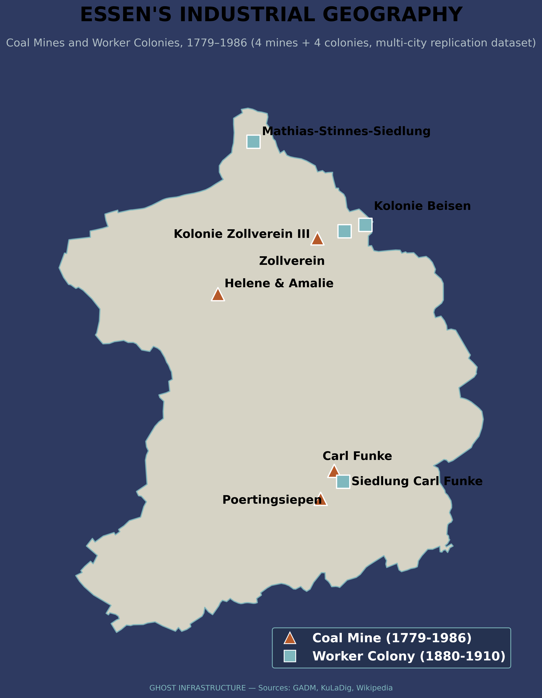

**Figure 4.** Historical coal-mining geography of Essen: four major coal mines and four worker colonies digitized from KuLaDig and German Wikipedia, directly comparable to Figure 2 (Bochum).

## 4. Results

### 4.1 Accessibility Coverage

85.8% of network nodes fell within a 15-minute walk of at least one essential service; 14.2% (9,858 nodes) did not.

  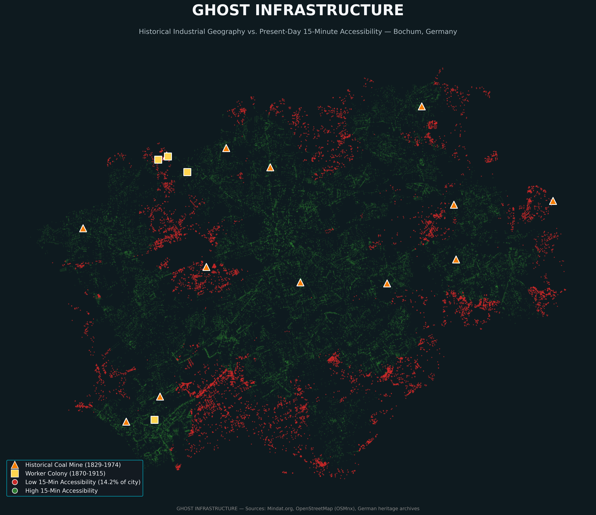

**Figure 5.** Overlay of historical coal-mining infrastructure and present-day 15-minute walking accessibility in Bochum. The visualization illustrates the spatial relationship between former industrial sites and modern accessibility patterns, providing the geographical basis for the statistical comparison presented in the following sections.

### 4.2 The Reversed Relationship

Low-accessibility nodes were, on average, further from historical industrial sites (1,984m) than high-accessibility nodes (1,450m) — a highly significant difference (Welch's t-test, t=42.887, p<0.00001), opposite in direction to the original hypothesis that industrial legacy would predict present-day neglect. The effect size is medium-to-large (Cohen's d=0.589, computed as the mean difference divided by the pooled standard deviation), indicating this is a practically meaningful difference and not merely a statistically significant one inflated by the very large sample size (69,393 nodes) — a distinction worth stating explicitly given how easily large-N studies can report a significant p-value for a trivially small effect.

  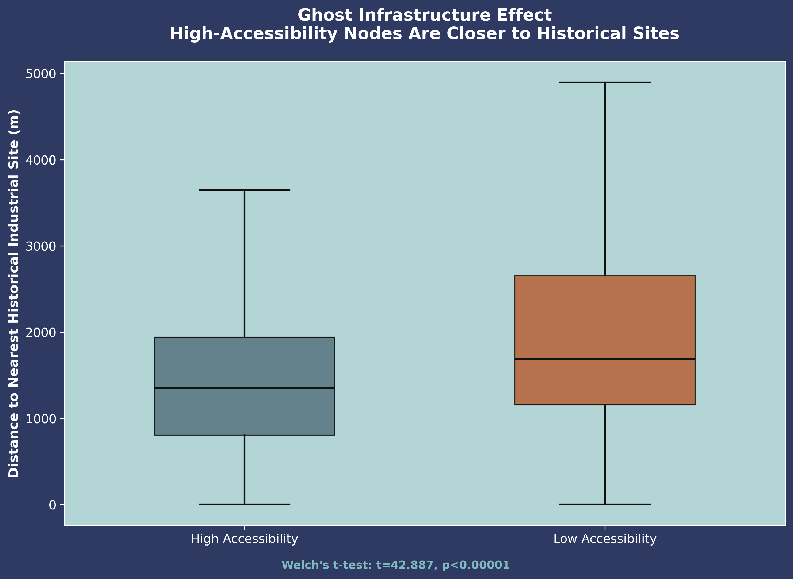

**Figure 6.** Boxplot comparing the distance from historical coal-mining sites for high-accessibility and low-accessibility locations. Contrary to the original hypothesis, low-accessibility locations are significantly farther from former mining sites than high-accessibility locations, indicating that historical industrial geography does not predict present-day accessibility in the expected direction.

### 4.3 Confound Verification

Correlation between distance-to-historical-site and distance-to-city-center was low (r=0.063), indicating these are largely independent spatial variables. A logistic regression including both distances simultaneously found the historical-site effect remained statistically significant (coefficient=-0.0005, p<0.001) after controlling for city-center distance — confirming the reversed relationship is not merely a proxy for the well-documented city-center advantage established in the broader 15-minute-city literature. Converted to odds ratios, each 100m closer to a historical industrial site is associated with approximately 4.9% higher odds of 15-minute accessibility, compared to approximately 3.0% higher odds per 100m closer to the city center — the historical-site effect is, per unit distance, the larger of the two.

### 4.4 Spatial Clustering: Local Moran's I

The Local Moran's I analysis (Section 3.5) found a mean local I of 0.923 across all nodes. 10,266 of 69,393 nodes (14.8%) formed statistically significant spatial clusters at p<0.05. Of these, 9,568 were Low-Low ("cold-spot") clusters — contiguous zones of low accessibility surrounded by other low-accessibility nodes — and 698 were High-Low spatial outliers (isolated low-accessibility nodes surrounded by high-accessibility neighbors); no statistically significant High-High or Low-High clusters were found.

  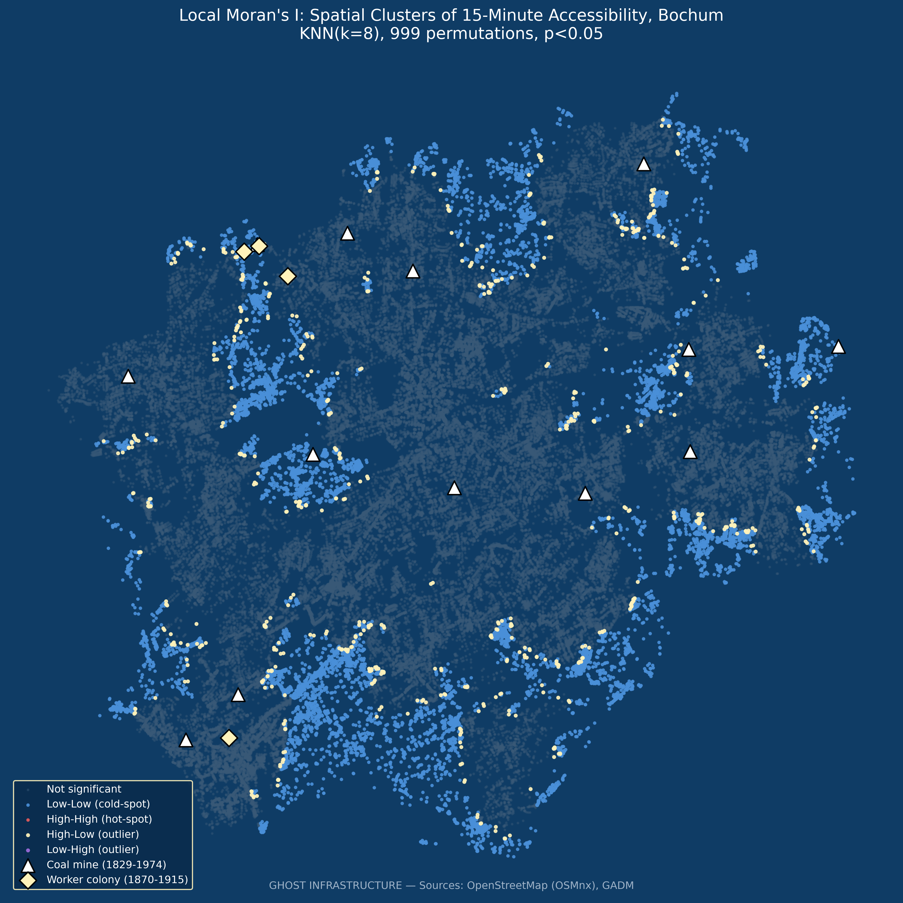

**Figure 7.** Local Moran's I cluster map. Blue points mark nodes belonging to statistically significant Low-Low ("cold-spot") clusters; gold points mark High-Low spatial outliers; grey points are not statistically significant. Historical coal mines (triangles) and worker colonies (diamonds) are overlaid for reference.

Cross-tabulating cluster membership against distance to historical sites: nodes in significant LL cold-spot clusters average 1,992.3m from the nearest historical industrial site, compared to 1,447.1m for non-significant nodes. Critically, 97.1% of all low-accessibility nodes fall within a statistically significant LL cluster — meaning low accessibility in Bochum is not scattered randomly across the city but forms genuine, spatially contiguous cold-spots, and those cold-spots are measurably farther from historical industrial infrastructure than the rest of the network. This result directly fulfills the spatial-clustering test named in this study's original Objectives, and corroborates the Section 4.2–4.3 findings via a statistically independent method that explicitly accounts for spatial structure rather than treating nodes as independent observations.

### 4.5 Threshold-Sensitivity Results

The reversed relationship is not an artifact of the specific 15-minute threshold chosen. At a stricter 10-minute threshold (750m, 67.1% coverage), low-accessibility nodes remain significantly further from historical sites (1,778m vs. 1,402m; Welch's t=47.062, p<0.00001, Cohen's d=0.413). At a more permissive 20-minute threshold (1,500m, 94.4% coverage), the same pattern holds and, notably, strengthens (2,098m vs. 1,492m; t=32.150, p<0.00001, Cohen's d=0.661) — larger than the original 15-minute effect (d=0.589). The odds ratio per 100m closer to a historical site remains stable across all three thresholds (10-min: 4.24%, 15-min: 4.88%, 20-min: 4.49% higher odds of accessibility, all p<0.00001, controlling for city-center distance), confirming this is a genuinely robust relationship rather than a threshold-dependent artifact.

  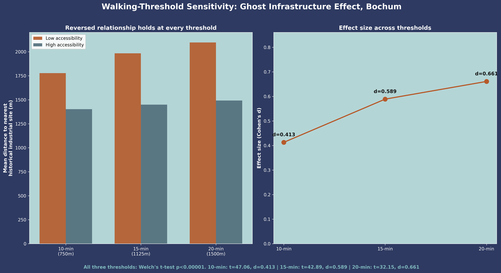

**Figure 8.** Walking-threshold sensitivity: mean distance to nearest historical site by accessibility group (left) and effect size (right), at 10-, 15-, and 20-minute thresholds. The reversed relationship holds — and strengthens — across all three.

### 4.6 Multi-City Replication: Essen

Essen's results present a genuinely mixed replication picture, reported here in full rather than selectively. The raw reversed relationship replicates in both direction and statistical significance: low-accessibility nodes (n=8,267) average 3,693m from the nearest historical site versus 3,130m for high-accessibility nodes (n=63,760) — Welch's t=24.731, p<0.00001 — though with a smaller effect size than Bochum (Cohen's d=0.338 versus 0.589). The Local Moran's I spatial-clustering result replicates almost exactly: mean local I=0.917 (versus Bochum's 0.923), and 95.5% of Essen's low-accessibility nodes fall within statistically significant Low-Low cold-spot clusters (versus 97.1% in Bochum) — with, as in Bochum, zero significant High-High hot-spot clusters found in either city.

  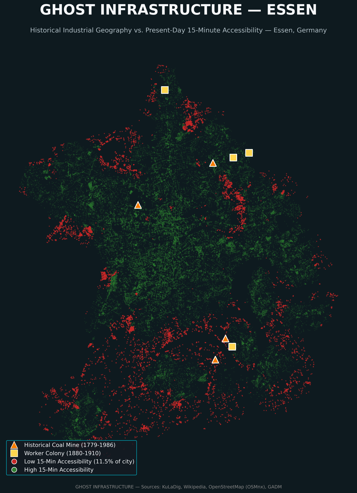

**Figure 9.** Overlay of historical industrial infrastructure and present-day 15-minute walking accessibility in Essen, directly comparable to Figure 5 (Bochum).

  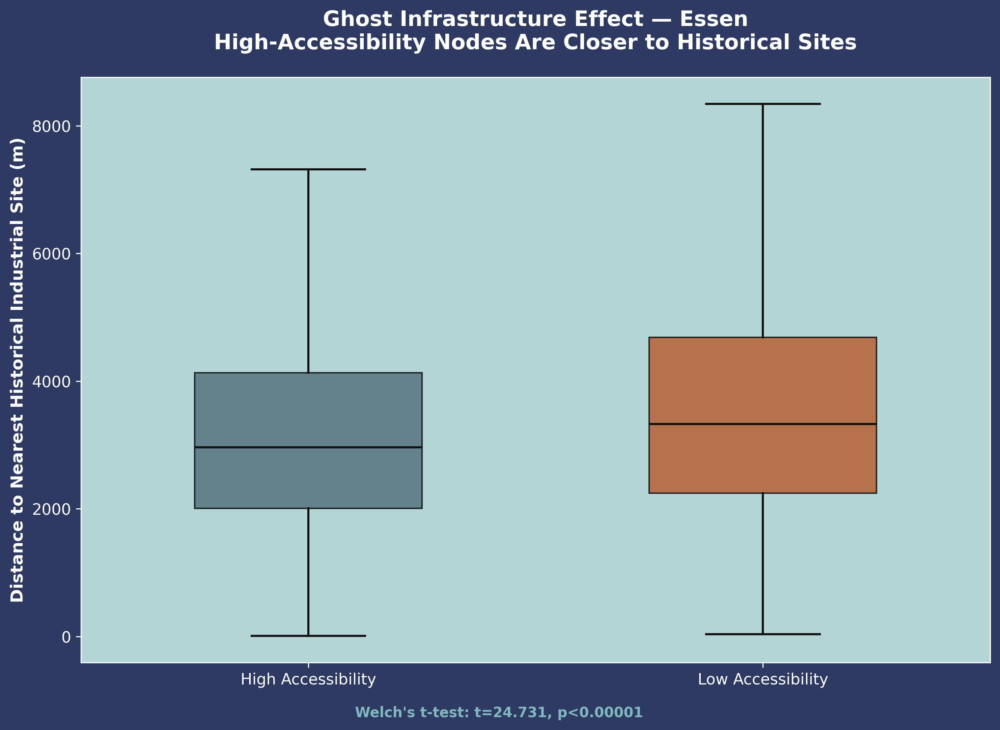

**Figure 10.** Boxplot comparing distance from historical sites for high- and low-accessibility locations in Essen, directly comparable to Figure 6 (Bochum). The reversed relationship — low-accessibility nodes farther from historical sites — replicates, with a smaller effect size than Bochum.

The confound-independence result, however, does not replicate. Correlation between distance-to-historical-site and distance-to-city-center in Essen is r=0.405 — substantially higher than Bochum's r=0.063, and well outside the range where the two variables can be treated as independent. Consistent with this, a logistic regression predicting accessibility from both distances simultaneously finds the historical-site coefficient's sign reverses in Essen (coefficient=+0.0001, p<0.00001) relative to Bochum (coefficient=-0.0005) — meaning that once city-center distance is statistically controlled for, greater distance from a historical site is associated with *higher*, not lower, odds of accessibility in Essen. The city-center effect itself remains a strong, consistent predictor in both cities (odds per 100m closer to center: 3.0% in Bochum, 4.2% in Essen).

  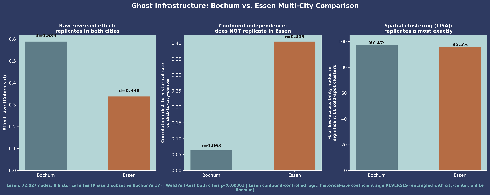

**Figure 11.** Bochum vs. Essen comparison across the three statistical tests. The raw reversed effect and the Local Moran's I spatial-clustering result both replicate; the confound-independence result does not.

  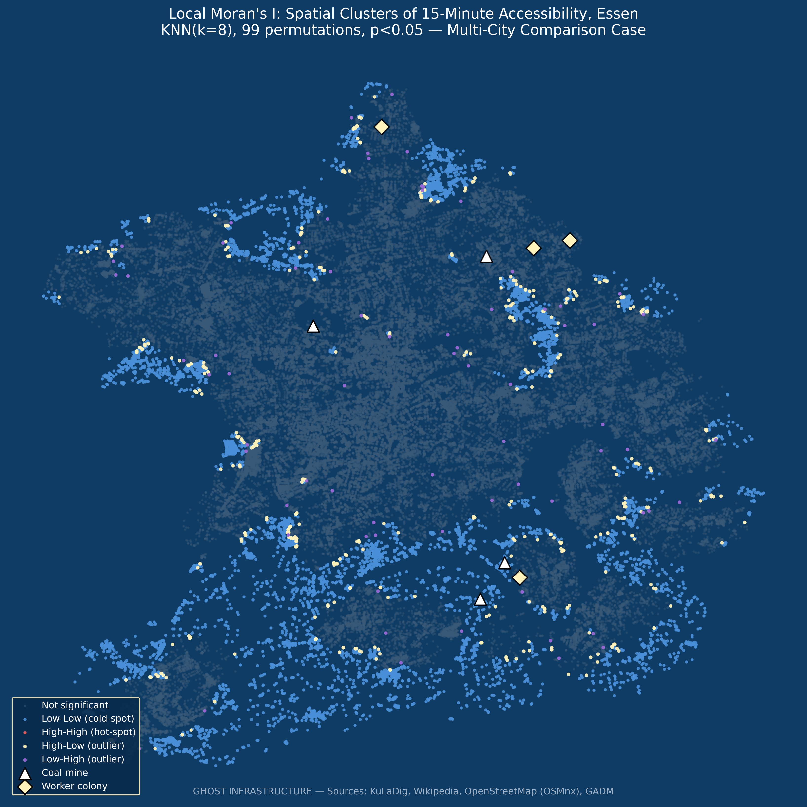

**Figure 12.** Local Moran's I cluster map for Essen, directly comparable to Figure 7 (Bochum).

This pattern is interpreted honestly rather than as either a clean replication or a failed one. The interpretation offered in Section 5 (that dense historical industrial infrastructure left a durable centrality/connectivity legacy) is not contradicted by the Essen result — the raw relationship and its spatial-clustering signature both still hold. What does not generalize is the *stronger, more specific* claim that this effect is statistically independent of city-center proximity. A plausible explanation is that Essen's historical industrial geography is, in fact, more spatially concentrated around its city center than Bochum's is — a genuine difference in each city's own urban-industrial history, since Essen's core coal-mining and administrative activity (including the Krupp steelworks' historical footprint, immediately adjacent to but distinct from this study's coal-mining-only scope) developed in closer proximity to the present-day city center than Bochum's more geographically dispersed mining sites did. A second, methodologically important possibility is that Essen's smaller historical-site sample (8 sites, versus Bochum's 17) inflates this correlation as a sampling artifact: with fewer reference points spread across a larger city, "distance to the nearest of a few points" becomes more likely to covary with "distance from the geographic center" purely from reduced spatial coverage density, independent of any real difference in historical geography. Expanding an earlier 6-site version of the Essen dataset to the current 8 sites reduced this correlation somewhat (from r=0.475 to r=0.405), which is consistent with — though does not prove — the sampling-artifact explanation; this is flagged explicitly in Section 7 (Limitations) as the reason this specific sub-finding should be treated as provisional pending a fuller Essen dataset, while the raw-effect and spatial-clustering replications, which do not depend on the confound-control regression, are treated as more secure.

## 5. Discussion

This finding is best understood as a "path dependency of centrality" rather than a "path dependency of neglect." Nineteenth-century coal and steel infrastructure was built, by economic necessity, at the center of dense worker populations — with the road networks, market infrastructure, and housing density required to serve that population. This study's evidence suggests that dense historical infrastructure footprint, independent of the modern city center's location, has left a durable legacy of street connectivity and service density persisting more than fifty years after the mines closed. This directly extends the path-dependency literature — previously applied primarily to broad urban growth patterns and port-city institutional arrangements — into the finer-grained domain of intra-city walkable accessibility, while remaining consistent with, rather than contradicting, the established finding that centrality (of any origin, historical or contemporary) predicts better accessibility outcomes.

A note on the project's title and framing is warranted given this finding. "Ghost Infrastructure" was chosen to evoke infrastructure whose original economic function has vanished while its physical and spatial legacy persists — the mines are gone, but their effect on the city's fabric is not. It is not intended to imply that this legacy is one of neglect or abandonment; the results show the opposite. Read precisely, the "ghost" in the title refers to an absent cause (the coal industry) producing a present, measurable, and — as this study finds — largely positive effect (durable centrality and connectivity), not to a haunted or neglected present-day landscape.

The Essen replication (Section 4.6) adds an important qualification to this interpretation. The core claim — that historical industrial density left a durable centrality/connectivity legacy, corroborated independently via spatial clustering — held in both cities. The narrower claim that this legacy operates *independently* of present-day city-center proximity is better understood as a Bochum-specific finding, not yet established as general across the Ruhr Valley. This is consistent with, rather than a threat to, the overall "path dependency of centrality" framing: if historical industrial cores and present-day city centers are themselves more spatially entangled in some cities than others (plausibly reflecting each city's own specific industrial and administrative history), then the *relative contribution* of historical-versus-present centrality to today's accessibility patterns may reasonably vary by city, even while the underlying centrality-legacy mechanism itself holds across cities.

## 6. Policy Implications

If historical industrial cores retain a durable centrality advantage rather than accumulating disadvantage, post-industrial urban planning in the Ruhr Valley and comparable regions may be better served by treating these areas as accessibility assets to reinforce — through infill development, mixed-use zoning, and continued service provision — rather than as legacy-neglect zones requiring remedial investment. Conversely, this study's finding that accessibility gaps concentrate in areas *away* from the historical industrial core suggests that peripheral, more recently developed neighborhoods — not the historic industrial center — may be the areas most in need of targeted 15-minute-city infrastructure investment. This reframing does not diminish the value of heritage-led regeneration in former industrial cores; it suggests such regeneration may be building on an already-favorable accessibility foundation, while the more urgent accessibility deficit lies elsewhere in the city.

## 7. Limitations

The worker-colony dataset (4 sites) is smaller than the coal-mine dataset (13 sites), somewhat limiting the statistical power of colony-specific sub-analysis. The 13 mines and 4 colonies analyzed here represent the major, well-documented industrial-era sites in Bochum, not the city's complete historical mining register, which includes several hundred additional small-scale operations (Kleinzechen, Erbstollen) spanning multiple centuries; these are not comparable in scale or documentation quality to the major Zechen analyzed here and no coverage percentage is claimed against that broader, heterogeneous register. This study relies on point-based historical site locations rather than full manual digitization of mine and colony boundary extents, a scope decision made given project timeline constraints. Industrial-era rail and road infrastructure — part of this project's original conceptual scope — was not digitized in this phase (see Future Work, Section 8). All essential-service categories were treated as equally weighted in the accessibility model, which does not capture genuine variation in how urgently different service types matter to daily life. The city-center reference point used in the confound analysis (Bochum Hauptbahnhof) is, in this compact city, geographically coincident with the Rathaus and commercial core within a few hundred meters — a genuinely distinct second reference point could not be verified for a robustness check, so this study cannot rule out that a differently defined city center might yield a modestly different confound estimate, though the very low correlation (r=0.063) between the two distance measures makes a materially different result unlikely. Socioeconomic confounders (income, age, tenure, car ownership) were not available for this analysis and are not controlled for; the reported relationships should be read as descriptive spatial associations, not fully adjusted causal estimates. Finally, the Local Moran's I analysis (Section 4.4), like the underlying accessibility data itself, treats the 69,393 street-network nodes as the unit of analysis; because nearby nodes share street segments and service catchments by construction, they are not independent observations, which the KNN-based spatial weights matrix is specifically designed to account for — but readers should note this spatial non-independence when interpreting the raw node count (rather than the cluster-level pattern) as a sample size.

The Essen replication (Section 4.6) carries its own, explicitly flagged limitation: its 8-site historical dataset (4 mines, 4 colonies) is a smaller subset of Essen's much larger historical mining register (~1,700 facilities citywide per the city's own historical portal) than the Bochum dataset is of Bochum's, and — unlike Bochum, where confound-independence was tested on the full 17-site dataset — the Essen confound-independence result should be treated as provisional. Expanding the 6-site version of this dataset used in initial testing to the current 8 sites measurably reduced the historical-site/city-center correlation (r=0.475 → r=0.405), which is consistent with a sampling-density explanation for at least part of the effect, though it does not rule out a genuine underlying difference between the two cities' industrial geography. Resolving which explanation dominates would require expanding the Essen historical dataset toward Bochum's 17-site scale, identified as Future Work (Section 8) rather than attempted further in this round given the practical geocoding-precision constraints on remaining, less-documented historical Essen mining sites.

## 8. Future Work

Two items originally listed here have since been addressed and are now reported in Sections 3.6–3.7 and 4.5–4.6: walking-time-threshold sensitivity (confirmed robust at 10- and 20-minute thresholds) and multi-city comparison (replicated in Essen, with a nuanced result — see Section 4.6). This study's remaining scope decisions point to further directions for follow-up research, listed here rather than left implicit:

- **Expand the Essen historical dataset toward Bochum's scale.** The current 8-site Essen dataset (versus Bochum's 17) leaves the confound-independence question (Section 4.6) provisional; digitizing additional major Essen mines and colonies — starting from the ~1,700-facility register catalogued by historischesportal.essen.de — would give a more decisive test of whether Essen's higher historical-site/city-center correlation reflects genuine urban-history difference or residual sampling density.
- **A third and fourth Ruhr Valley city.** Extending the multi-city replication beyond Bochum and Essen (e.g., Dortmund, Gelsenkirchen) would clarify whether Essen's confound-independence departure from Bochum is itself the more common pattern across the region, or whether Bochum's clean independence is more typical and Essen the outlier.
- **Socioeconomic confounders.** Incorporating income, age, tenure, and car-ownership data (e.g., from German census/Zensus sources) to test whether the historical-site effect holds after controlling for present-day socioeconomic composition.
- **Weighted service index.** Replacing the equally-weighted essential-service accessibility measure with a weighted index reflecting the differential importance of service categories (e.g., healthcare and groceries weighted more heavily than green space).
- **Geographically Weighted Regression (GWR).** Modeling the historical-site effect as spatially varying across the city, rather than assuming a single global coefficient, to test whether the effect is stronger in some parts of Bochum (or Essen) than others.
- **Multi-year, phenology-normalized time-series trend.** Extending the present cross-sectional design to track how the historical-site accessibility advantage has changed over time, rather than testing a single present-day snapshot.
- **Industrial-era transportation network digitization.** Digitizing historical rail and road infrastructure — part of this project's original conceptual scope (see Section 3.2) — to test whether historical transportation connectivity, not just proximity to mines and colonies, independently predicts present-day accessibility.
- **Polygon-based historical site boundaries.** Replacing point-based mine and colony locations with digitized boundary polygons, to test whether the finding is sensitive to this representational choice.

## 9. Conclusion

Nearly a century and a half after Bochum's industrialization began, and more than fifty years after its last coal mine closed, historical industrial geography continues to leave a statistically significant, independently verified imprint on present-day walkable accessibility — not through neglect, as originally hypothesized, but through the enduring legacy of dense infrastructure built to serve 19th-century industrial populations. This finding directly extends path-dependency theory into a new, quantitatively testable domain, and demonstrates that a rigorously verified "surprising" result — checked explicitly against its most likely confound and corroborated by an independent spatial-clustering test — can constitute a more substantive contribution than a hypothesis confirmed at face value.

Two subsequent robustness extensions reinforce and refine this conclusion rather than simply confirming it. The reversed relationship is not an artifact of the specific 15-minute accessibility threshold — it holds, and strengthens, at both 10- and 20-minute thresholds. And replicating the full methodology in a second city, Essen, shows the underlying "path dependency of centrality" mechanism — the raw reversed effect and its spatial-clustering signature — generalizes beyond Bochum, while the specific claim that this effect is statistically independent of city-center proximity does not straightforwardly generalize, and is better treated as a city-specific finding pending a larger Essen dataset. Reporting this mixed replication result in full, rather than only the parts that confirm the original city's findings, is itself consistent with this study's broader methodological commitment: an unexpected or partial result, investigated and reported honestly, is more valuable than a tidier-looking but incomplete picture.

## References

Arthur, W. B. (1988). Urban Systems and Historical Path Dependence. In *Cities and Their Vital Systems: Infrastructure Past, Present, and Future* (pp. 85–97). National Academies Press. [https://www.nationalacademies.org/read/1093/chapter/5](https://www.nationalacademies.org/read/1093/chapter/5)

Görmar, F., & Harfst, J. (2019). Path Renewal or Path Dependence? The Role of Industrial Culture in Regional Restructuring. *Urban Science*, 3(4), 106. [https://doi.org/10.3390/urbansci3040106](https://doi.org/10.3390/urbansci3040106)

Hein, C., & Schubert, D. (2021). Resilience and Path Dependence: A Comparative Study of the Port Cities of London, Hamburg, and Philadelphia. *Journal of Urban History*, 47(2), 389–419. [https://doi.org/10.1177/0096144220925098](https://doi.org/10.1177/0096144220925098)

Bruno, M., Melo, H. P. M., Campanelli, B., & Loreto, V. (2024). A universal framework for inclusive 15-minute cities. *Nature Cities*, 1(10), 633–641. [https://doi.org/10.1038/s44284-024-00119-4](https://doi.org/10.1038/s44284-024-00119-4)

Omwamba, J., Rotaris, L., & Longo, G. (2025). An assessment of proximity in the 15-Minute City: A systematic literature review. *Urban Transitions*, 3, 100012. [https://doi.org/10.1016/j.ubtr.2025.100012](https://doi.org/10.1016/j.ubtr.2025.100012)

Moreno, C., Gall, C., Woo, J., Lee, D., & Bencekri, M. (2025). Assessing accessibility of cultural sites through the 15-minute city framework in Seoul. *International Journal of Urban Sciences*, 29(1), 8–39. [https://doi.org/10.1080/12265934.2025.2462820](https://doi.org/10.1080/12265934.2025.2462820)

