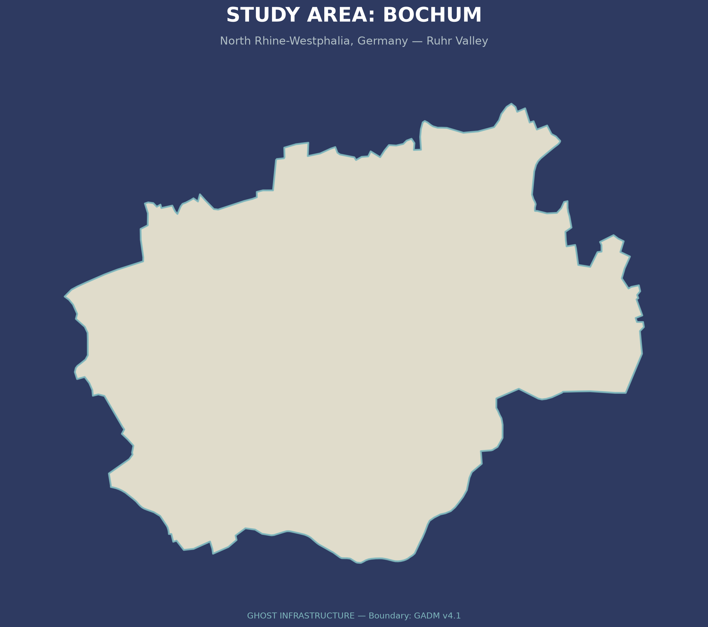
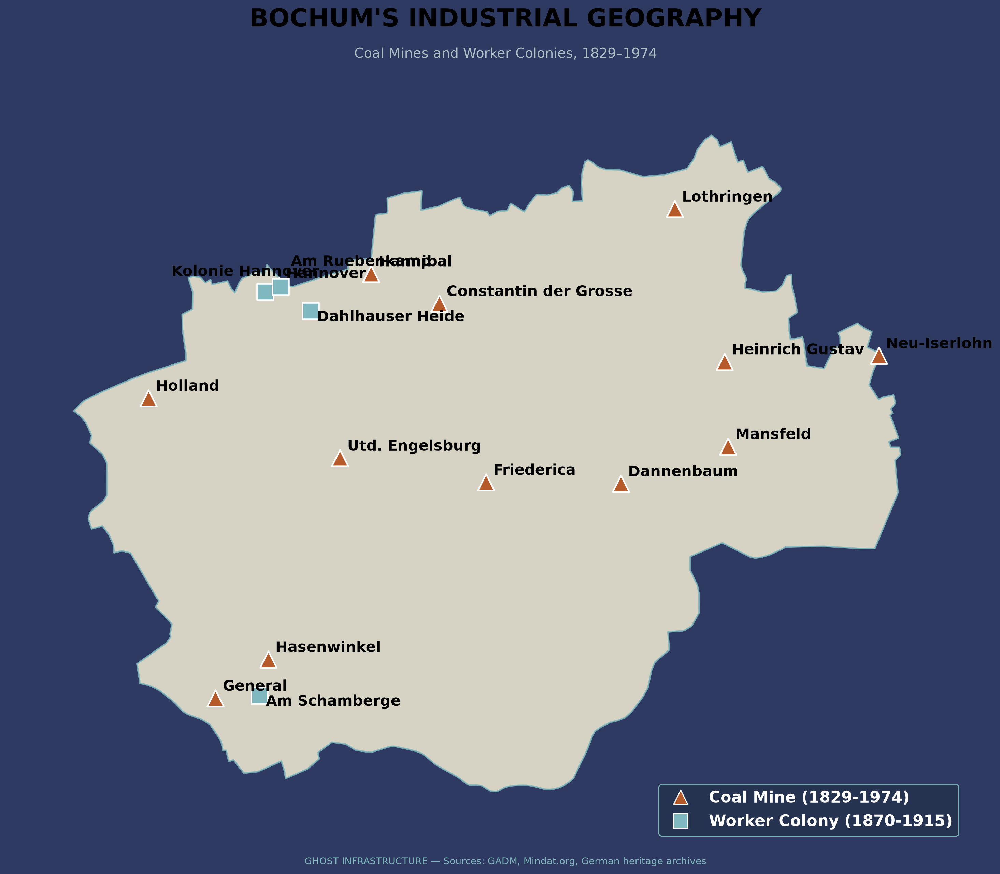
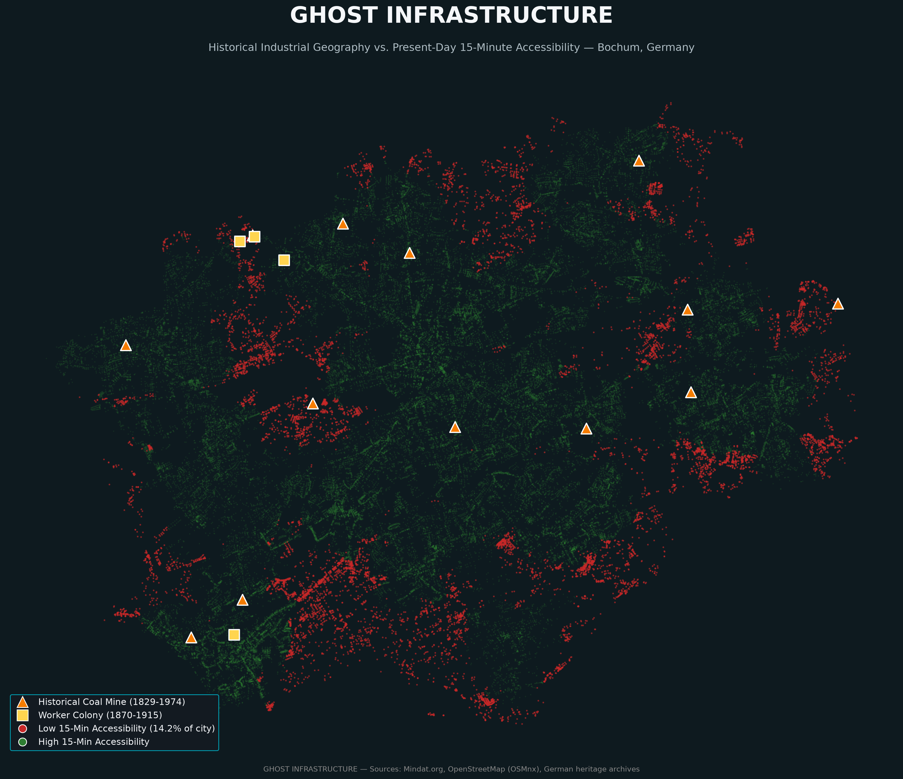
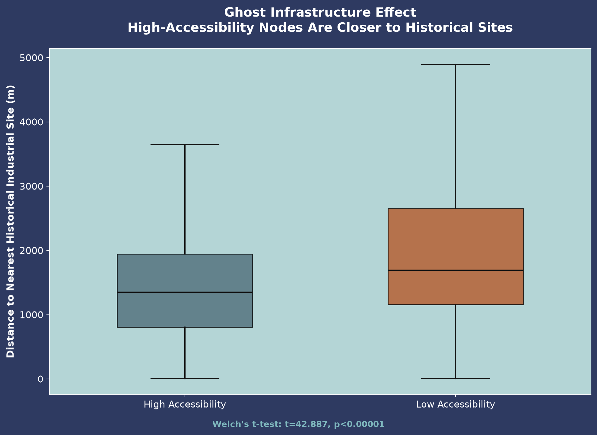

# Sakshi D. Maske
Independent Geospatial Researcher

## Abstract

The theoretical concept of "path dependency" — that historical spatial decisions continue to shape present-day urban outcomes long after their original rationale has disappeared — is well established in economic geography, yet rarely tested with direct, quantitative spatial evidence, particularly at the scale of a single city's internal accessibility structure. This study tests whether Bochum's 19th and 20th-century coal-mining industrial geography — mine locations and worker-housing colonies (Zechensiedlungen) — continues to structurally predict present-day "15-minute city" walking accessibility, more than five decades after the region's last coal mine closed. Thirteen historical coal mines and four worker colonies were digitized from archival sources, and present-day accessibility was modeled using true network-distance isochrones across Bochum's complete 69,393-node pedestrian street network. Contrary to the hypothesis that historical industrial sites would predict present-day neglect, a Welch's t-test found the opposite: low-accessibility network nodes are significantly further from historical industrial sites than high-accessibility nodes (t=42.887, p<0.00001). This reversed relationship was verified against its most obvious confound — proximity to the city center, a well-documented predictor of accessibility in the broader 15-minute-city literature — and found to hold independently (logistic regression coefficient=-0.0005, p<0.001, controlling for city-center distance; correlation between the two distance measures was low, r=0.063). The evidence supports a "path dependency of centrality" rather than a "path dependency of neglect": historical industrial infrastructure, built by necessity at the center of dense worker populations, appears to have left a durable legacy of street connectivity and service density that persists independently of the city's present-day center.

**Keywords**: path dependency, 15-minute city, urban accessibility, historical GIS, network analysis, post-industrial geography

---

## 1. Introduction

Bochum's urban form was never designed around human accessibility. It was built around coal mines and steel works, with railways, roads, and worker-housing colonies laid out to serve 19th-century industrial production. The last coal mine in Bochum closed in 1974. This study asks whether that historical industrial geography — more than half a century removed from its original economic function — continues to leave a measurable, statistically detectable imprint on which parts of the city today offer genuine walkable access to essential services.

## 2. Literature Review

### 2.1 Path Dependency: A Well-Established Theory, Rarely Tested Spatially

Path dependency — the principle that the past shapes the present through locked-in infrastructure and institutional decisions — is a long-established concept spanning economic geography, urban history, and evolutionary economics. Urban spatial structure has been characterized as heavily path-dependent, with a neighborhood's present-day form continuing to reflect the infrastructure, land-use patterns, and dominant transportation technology of the era in which it was built. Studies of port cities have similarly argued that the longevity of historical infrastructure investment makes spatial and institutional transitions difficult long after a port's original economic function has diminished. Despite this substantial theoretical foundation, direct, quantitative, GIS-based testing of path dependency at the scale of intra-city accessibility — rather than broad city growth patterns or institutional governance arrangements — remains comparatively rare, representing the specific gap this study addresses.

### 2.2 The 15-Minute City and the City-Center Advantage

The 15-minute city framework, prioritizing proximity-based access to essential services via walking and cycling, has generated a substantial and rapidly growing empirical literature since 2021, with over 100 peer-reviewed publications identified in a recent systematic review spanning 2021 to early 2025. Network-based accessibility modeling — computing true walking-network distance to points of interest rather than simplified straight-line radii — has emerged as the dominant methodological approach in this literature, directly consistent with the network-distance methodology adopted in this study. A large-scale comparative study spanning 10,000 cities globally found a consistent and largely unsurprising pattern: city centers have measurably better service access than peripheral areas. This finding is directly relevant to the present study's methodology, since it establishes city-center proximity as a well-documented, independent predictor of accessibility in its own right — precisely the confound this study needed to rule out before treating any historical-industrial-site effect as genuine.

## 3. Data and Methodology

### 3.1 Study Area

Bochum, North Rhine-Westphalia, Germany — a defining Ruhr Valley coal and steel city from the mid-19th century through the 1950s, with its final coal mine closing in 1974.

  

**Figure 1.** Study area showing the administrative boundary of Bochum, North Rhine-Westphalia, Germany. Bochum was selected as the study area because of its well-documented coal-mining history and its transformation into a post-industrial city, providing an ideal setting to examine whether nineteenth- and twentieth-century industrial geography continues to influence present-day 15-minute-city accessibility.

### 3.2 Historical Data

Thirteen coal mines and four worker-housing colonies (Zechensiedlungen) were compiled from Mindat.org and German heritage archival sources, kept as two independent, structurally distinct GIS layers given their categorically different nature (extraction site versus residential housing). A proposed steelworker colony was explicitly excluded during data review, since it was linked to steel rather than coal production.

  

**Figure 2.** Historical coal-mining geography of Bochum derived from nineteenth-century industrial maps. Former mining sites are shown alongside the modern administrative boundary, providing the historical spatial framework used to evaluate whether legacy industrial infrastructure continues to influence present-day urban accessibility.

### 3.3 Present-Day Accessibility Model

Bochum's complete pedestrian street network (69,393 nodes, 169,668 edges) was acquired via OSMnx, alongside 786 essential-service points of interest across health, education, and daily-needs categories. A 15-minute walking threshold was operationalized as 1,125 meters of true network distance, computed via Dijkstra's shortest-path algorithm from every service location — consistent with the network-based approach dominant in the current 15-minute-city literature, and avoiding the straight-line-radius approach known to overstate real walkable accessibility.

### 3.4 Statistical Testing and Confound Verification

Distance from each network node to its nearest historical industrial site was computed and compared between low- and high-accessibility node groups via Welch's t-test. Given the established literature finding that city-center proximity independently predicts accessibility, this was explicitly tested as a potential confound: correlation between distance-to-historical-site and distance-to-city-center, and a logistic regression predicting accessibility from both distance measures simultaneously.

## 4. Results

### 4.1 Accessibility Coverage

85.8% of network nodes fell within a 15-minute walk of at least one essential service; 14.2% (9,858 nodes) did not.

  

**Figure 3.** Overlay of historical coal-mining infrastructure and present-day 15-minute walking accessibility in Bochum. The visualization illustrates the spatial relationship between former industrial sites and modern accessibility patterns, providing the geographical basis for the statistical comparison presented in the following sections.

### 4.2 The Reversed Relationship

Low-accessibility nodes were, on average, further from historical industrial sites (1,984m) than high-accessibility nodes (1,450m) — a highly significant difference (Welch's t-test, t=42.887, p<0.00001), opposite in direction to the original hypothesis that industrial legacy would predict present-day neglect.

  

**Figure 4.** Boxplot comparing the distance from historical coal-mining sites for high-accessibility and low-accessibility locations. Contrary to the original hypothesis, low-accessibility locations are significantly farther from former mining sites than high-accessibility locations, indicating that historical industrial geography does not predict present-day accessibility in the expected direction.

### 4.3 Confound Verification

Correlation between distance-to-historical-site and distance-to-city-center was low (r=0.063), indicating these are largely independent spatial variables. A logistic regression including both distances simultaneously found the historical-site effect remained statistically significant (coefficient=-0.0005, p<0.001) after controlling for city-center distance — confirming the reversed relationship is not merely a proxy for the well-documented city-center advantage established in the broader 15-minute-city literature.

## 5. Discussion

This finding is best understood as a "path dependency of centrality" rather than a "path dependency of neglect." Nineteenth-century coal and steel infrastructure was built, by economic necessity, at the center of dense worker populations — with the road networks, market infrastructure, and housing density required to serve that population. This study's evidence suggests that dense historical infrastructure footprint, independent of the modern city center's location, has left a durable legacy of street connectivity and service density persisting more than fifty years after the mines closed. This directly extends the path-dependency literature — previously applied primarily to broad urban growth patterns and port-city institutional arrangements — into the finer-grained domain of intra-city walkable accessibility, while remaining consistent with, rather than contradicting, the established finding that centrality (of any origin, historical or contemporary) predicts better accessibility outcomes.

## 6. Limitations

The worker-colony dataset (4 sites) is smaller than the coal-mine dataset (13 sites), somewhat limiting the statistical power of colony-specific sub-analysis. This study relies on point-based historical site locations rather than full manual digitization of mine and colony boundary extents, a scope decision made given project timeline constraints. All essential-service categories were treated as equally weighted in the accessibility model, which does not capture genuine variation in how urgently different service types matter to daily life.

## 7. Conclusion

Nearly a century and a half after Bochum's industrialization began, and more than fifty years after its last coal mine closed, historical industrial geography continues to leave a statistically significant, independently verified imprint on present-day walkable accessibility — not through neglect, as originally hypothesized, but through the enduring legacy of dense infrastructure built to serve 19th-century industrial populations. This finding directly extends path-dependency theory into a new, quantitatively testable domain, and demonstrates that a rigorously verified "surprising" result — checked explicitly against its most likely confound — can constitute a more substantive contribution than a hypothesis confirmed at face value.

## References

Arthur, W. B. (1988). Urban Systems and Historical Path Dependence, in *Cities and Their Vital Systems*. National Academies Press.

Hein, C., & Schubert, D. (2021). Resilience and Path Dependence: A Comparative Study of the Port Cities of London, Hamburg, and Philadelphia. *Journal of Urban History*.

Moreno, C., et al. Assessing accessibility through the 15-minute city framework. *International Journal of Urban Sciences* (2025).

Sony Computer Science Laboratories. A Universal Framework for Inclusive 15-minute Cities. *Nature Cities* (2024), as reported via CNU.org.

Systematic literature review: An assessment of proximity in the 15-Minute City. *ScienceDirect* (2025).

Bencekri, M., & Moreno, C. Assessing accessibility of cultural sites through the 15-minute city framework in Seoul. *International Journal of Urban Sciences* (2025).

---

**Full dataset, code, and reproducible pipeline**: github.com/sakshimaske303-commits/GHOST-INFRASTRUCTURE
**Live interactive dashboard**: *(https://ghostinfrastructure-areytvp4x8ofu6l5tosj2z.streamlit.app/)*